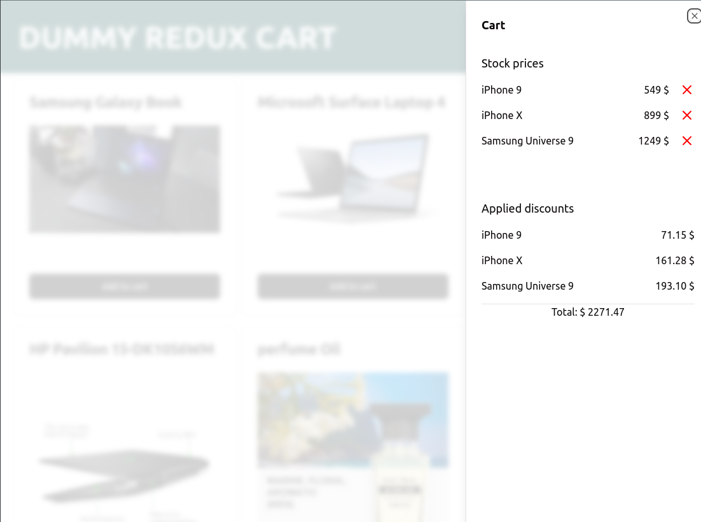

# Dummy Redux Cart

Just a little project to practice with `redux toolkit`. Adding products to cart with simple `reducers` and calculating discount with `extraReducers`.

Libraries:

- react
- redux roolkit
- typescript
- shadcn/ui

